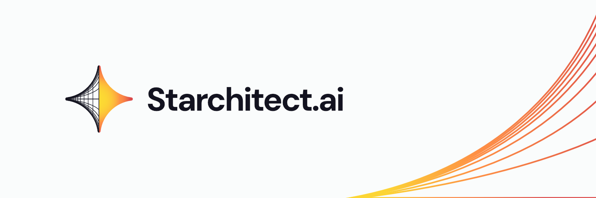

[Join our community!](https://discord.gg/r48ZahhA)
# Starchitect-CloudGuard

<!--   -->

 

---

Starchitect-CloudGuard is an open-source repository that writes tests for cloud infrastructure across various formats, including Terraform, Pulumi, Bicep, and CloudFormation. Cutting-edge AI-powered test-writing agents craft these tests with a well-defined understanding of cloud security. Each test undergoes meticulous human review by the experienced team at [The Non-Functionional Co.](https://nonfx.com), ensuring high-quality and reliable compliance validation.

This framework is designed to be flexible and extensible, allowing users to write and manage tests in their preferred formats. While Terraform is the primary focus, support for additional use cases and formats is constantly growing. If you have specific requirements, open a GitHub issue; our team will be happy to assist.

## Security Benchmark Coverage

| Benchmark | Status |
|-----------|--------|
| CIS Amazon Web Services Foundations | ✅ |
| CIS Google Cloud Computing Platform Foundation | ✅ |
| CIS Amazon Web Services Three-tier Web Architecture | ✅ |
| AWS Foundational Security Best Practices | ✅ |
| CIS Google Cloud Platform Security Foundations | ✅|

> All tests are implemented using [Fugue Regula](https://github.com/fugue/regula) for Terraform configurations

> CloudFormation, Pulumi, and Bicep tests are coming soon.

## Contributing

We welcome contributions from the community! To contribute to Starchitect-CloudGuard, please follow these steps:

1. Fork the repository.
2. Create a new branch for your feature or fix.
3. Make your changes and write tests.
4. Submit a pull request.
5. Await review and approval.

For more details, refer to the [Contributing Guide](CONTRIBUTING.md).

The Starchitect-CloudGuard community is vibrant and collaborative. Join us on our [Discord server](https://discord.gg/r48ZahhA) to connect, ask questions, share insights, and contribute to the project.